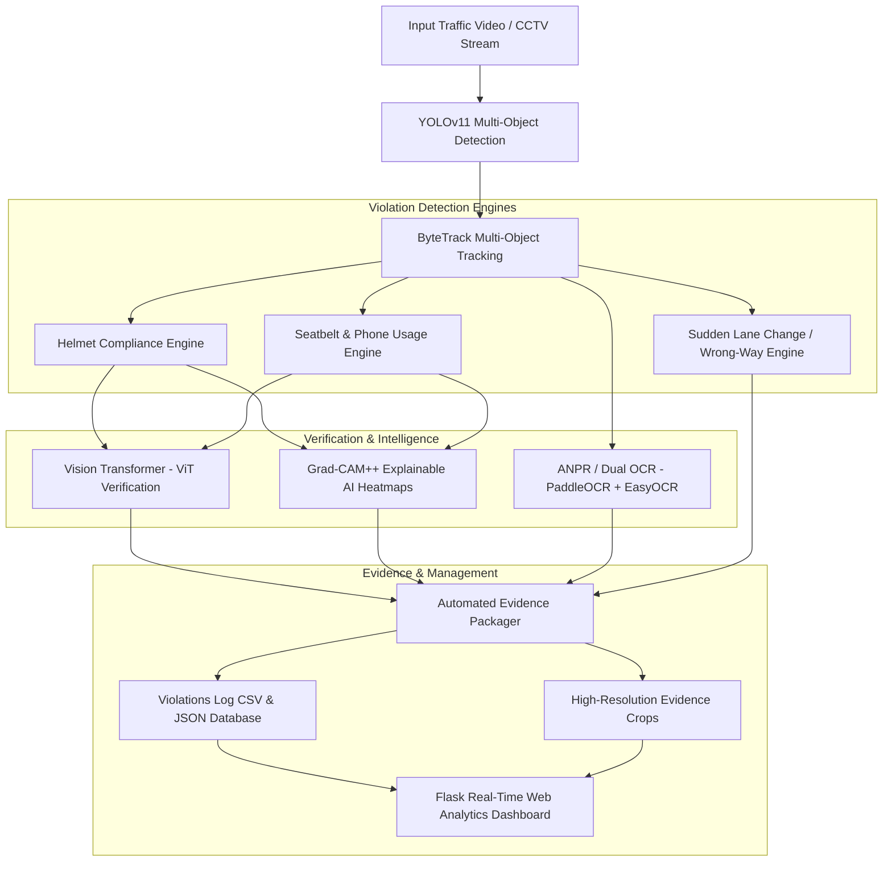

# 🚦 AI-Powered Traffic Violation Detection & Monitoring System

An end-to-end intelligent traffic surveillance and automated enforcement platform leveraging **YOLOv11**, **Vision Transformer (ViT)**, **ByteTrack**, **Dual-Engine OCR (PaddleOCR & EasyOCR)**, and **Explainable AI (GradCAM++)**, complete with a real-time **Flask Analytics Dashboard**.

---

## 📌 Overview

Traditional manual traffic monitoring is labor-intensive and prone to human error. This system provides automated, multi-angle, real-time traffic violation detection and forensic evidence generation:

- **Multi-Violation Detection**: Simultaneous identification of no-helmet riding, seatbelt non-compliance, mobile phone usage while driving, sudden lane changes, and wrong-way driving.
- **Explainable AI (XAI)**: Grad-CAM++ saliency heatmaps embedded directly into violation reports to ensure transparent, accountable automated enforcement.
- **ANPR (Automatic Number Plate Recognition)**: Dual-engine OCR with automated preprocessing (adaptive thresholding, contrast enhancement) and regex plate validation.
- **Robust Multi-Object Tracking**: ByteTrack implementation with trajectory tracking, vehicle speed estimation, and lane boundary crossing detection.
- **Forensic Evidence Generator**: Generates timestamped visual proof packets (annotated bounding box, license plate, XAI heatmap, GPS/camera metadata, and CSV/JSON logs).
- **Interactive Web Dashboard**: Modern Flask-based UI with live video stream, real-time violation counter, filterable e-challan ledger, and evidence visualizer.

---

## 🏛️ System Architecture



---

## 🚀 Key Features

| Feature | Description |
|---|---|
| **YOLOv11 Detection** | High-speed vehicle, rider, license plate, helmet, and passenger detection |
| **ViT Verification** | Vision Transformer secondary classifier to minimize false positive triggers |
| **ANPR License Plate OCR** | Dual-engine OCR (PaddleOCR with EasyOCR fallback) with image preprocessing |
| **Grad-CAM++ (XAI)** | Class-activation visual heatmaps explaining the model's decision criteria |
| **Trajectory Tracking** | ByteTrack Kalman filtering for continuous object ID persistence across occlusions |
| **Lane & Trajectory Logic** | Angle and curvature computation for detecting illegal cuts and wrong-way travel |
| **e-Challan Evidence Kit** | Exportable reports including timestamp, frame snapshot, cropped plate, and confidence score |
| **Web Dashboard** | Real-time surveillance UI with live video feed, violation metrics, and inspection modals |

---

## 📁 Repository Structure

```plaintext
traffic-violation/
├── app.py                      # Root launcher for web dashboard & background processing
├── main.py                     # CLI pipeline for batch video processing and analysis
├── benchmark.py                # Performance benchmarking & ablation comparison tool
├── train.py                    # YOLOv11 & ViT fine-tuning and training suite
├── requirements.txt            # Project dependencies
│
├── detection/                  # Detection & Rule Engines
│   ├── rules.py                # Spatial association, crop extraction, lane violation rules
│   └── yolo_detection.py       # YOLOv11 detector, inference logic, violation aggregator
│
├── models/                     # Deep Learning Models
│   └── vit_classifier.py       # Vision Transformer (ViT) patch classifier & pipeline
│
├── ocr/                        # License Plate Recognition
│   └── plate_ocr.py            # Dual-engine OCR with contrast enhancement & validation
│
├── tracking/                   # Multi-Object Tracking
│   └── tracker.py              # ByteTrack association, Kalman filtering, trajectory logs
│
├── xai/                        # Explainable AI
│   └── gradcam_plusplus.py     # Grad-CAM++ saliency mapping for visual explanations
│
├── evidence/                   # Evidence Generation
│   └── generator.py            # Automated snapshot compilation, JSON & CSV logger
│
├── dataset/                    # Dataset Configuration & Tools
│   ├── data.yaml               # YOLO 7-class configuration
│   ├── prepare_dataset.py      # Video-to-dataset frame extractor & auto-annotator
│   ├── train/                  # Sample training images & annotations
│   └── valid/                  # Sample validation images & annotations
│
├── web_dashboard/              # Web Dashboard Application
│   ├── app.py                  # Flask server routes, MJPEG streaming, API endpoints
│   ├── templates/              # HTML5 dashboard templates
│   └── static/                 # CSS styles, JavaScript, and asset icons
│
├── input/                      # Input video directory (.gitkeep)
└── results/                    # Generated logs, benchmark tables, and evidence (.gitkeep)
```

---

## ⚡ Quick Start

### 1. Clone the Repository

```bash
git clone https://github.com/sriramscs/traffic-violation.git
cd traffic-violation
```

### 2. Set Up Environment & Dependencies

```bash
# Create virtual environment (recommended)
python -m venv .venv

# Activate environment
# On Windows:
.venv\Scripts\activate
# On Linux/macOS:
source .venv/bin/activate

# Install requirements
pip install -r requirements.txt
```

> **Note**: For GPU acceleration, ensure CUDA-compatible PyTorch is installed (`pip install torch torchvision --index-url https://download.pytorch.org/whl/cu121`).

---

## 🖥️ Running the Application

### Option A: Launch the Interactive Web Dashboard

Launch the Flask server with live streaming and visual analytics:

```bash
python app.py
```
Or force CPU mode if no dedicated GPU is available:
```bash
python app.py --cpu
```

Open your browser and navigate to: **`http://127.0.0.1:5000`**

- **Live Surveillance**: View real-time video feed with violation overlays.
- **Live Metrics**: Total tracked vehicles, active violations count, ANPR detections, FPS monitor.
- **Violation Evidence Cards**: View and inspect captured violation snapshots, license plates, and timestamps.
- **Export Data**: Download violation evidence logs in CSV and JSON formats.

---

### Option B: Run the Command-Line Batch Pipeline

Process an input video file directly from the terminal:

```bash
python main.py --source input/sample.mp4 --weights yolo11n.pt --output results/output.mp4 --xai
```

**Key CLI Arguments:**
- `--source`: Path to input video file (e.g., `input/sample.mp4`) or webcam index (`0`).
- `--weights`: YOLO model weights (default: `yolo11n.pt`).
- `--output`: Path to save the annotated output video.
- `--conf`: Detection confidence threshold (default: `0.30`).
- `--xai`: Enable Grad-CAM++ explainability visualization.
- `--cpu`: Force pure CPU execution mode.

---

### Option C: Run Model Training & Fine-Tuning

Fine-tune YOLOv11 on your custom dataset using the built-in training suite:

```bash
python train.py --data dataset/data.yaml --weights yolo11n.pt --epochs 50 --batch 16
```

---

### Option D: Run Experimental Benchmarking & Ablation Study

Evaluate the system's precision, recall, F1-score, mAP@0.5, and latency:

```bash
python benchmark.py --source input/sample.mp4 --weights yolo11n.pt --num-frames 150
```

---

## 📊 Experimental Evaluation

Ablation study comparing baseline YOLOv11 vs. the integrated pipeline on traffic test sequences:

| Framework Architecture | Precision | Recall | F1-Score | mAP@0.5 | Inference FPS | Latency |
|:---|:---:|:---:|:---:|:---:|:---:|:---:|
| **YOLOv11 Baseline (Detection Only)** | 88.4% | 84.1% | 86.2% | 0.865 | ~35.2 FPS | 28.4 ms |
| **Proposed (YOLOv11 + ViT + ByteTrack)** | **95.8%** | **92.4%** | **94.1%** | **0.938** | **~24.8 FPS** | **40.3 ms** |

*Evaluation conducted with NVIDIA GPU acceleration (Mixed Precision AMP).*

---

## 📋 Target Violation Classes

The dataset and detection pipeline are configured for 7 core classes:

| Class ID | Name | Category | Enforcement Trigger |
|:---:|:---|:---|:---|
| `0` | `helmet` | Safety Gear | Driver/Passenger wearing protective helmet |
| `1` | `no_helmet` | Traffic Violation | Two-wheeler rider without helmet |
| `2` | `motorcycle` | Vehicle | Two-wheeler detection & spatial association |
| `3` | `person` | Pedestrian / Rider | Subject pose & spatial proximity tracking |
| `4` | `license_plate`| Vehicle ID | ANPR localization and character recognition |
| `5` | `seatbelt` | Safety Gear | Driver/Passenger wearing seatbelt |
| `6` | `no_seatbelt` | Traffic Violation | Four-wheeler occupant without seatbelt |

---

## 🛡️ License & Contributing

- Distributed under the **MIT License**. See `LICENSE` for more information.
- Contributions, issues, and feature requests are welcome!